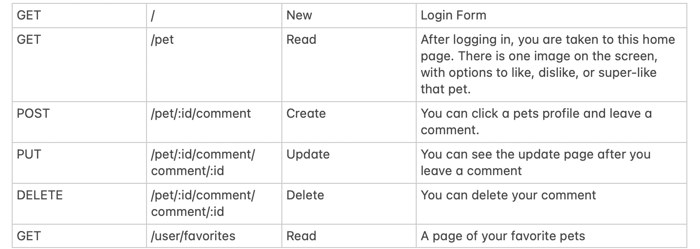
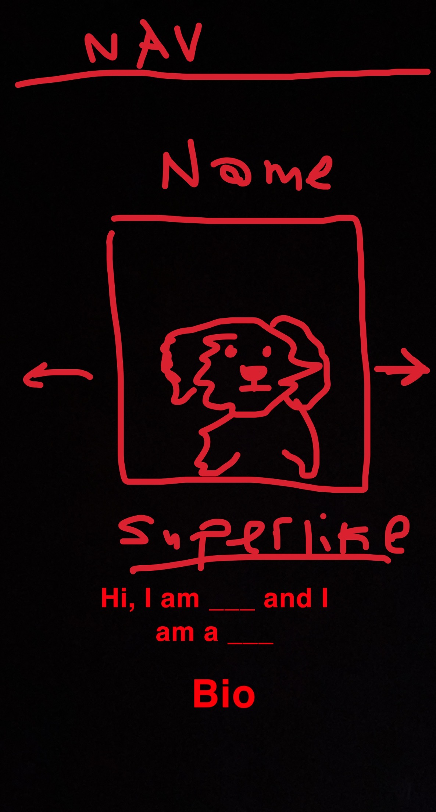
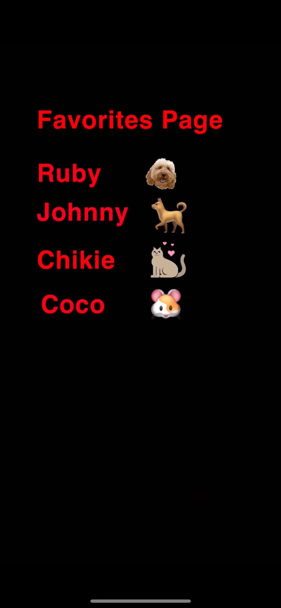

# Pet Connect - Find Your Perfect Match
What is Pet Connect 
An app that allows the user to like various pets that are up for adoption.
You can add pets to your favorites.

## The pets are adoptable and can be found on this API:  https://www.petfinder.com/developers/

## Models
This is the part I'm the most confused about.
I was thinking:
Model 1- users
Model 2- pets
Model 3- actions columns -> like, dislike, superlike

## Layout 
Route 1-
Create account or login
Don’t want to make an account? Use this login info …

Route 2- login takes you to main page
Swipe page 
Can swipe right, left, or hit a super like button 

Route 3- Favorites Page
You can see your collection 

Route 4- profile page with a bio 

## User Stories 
- As a user I want to access a site that shows me adoptable pets one image at a time 
- As a user I want to be able to like and delete different pets
- As a user I want to be able to leave a bio on my profiles 
- As a user I want to see the pets that I liked

## MVP GOALS
- Four routes
- CRUD
- Like button
- Favorites
- Pet info from the API
- Profile page
## STRETCH GOALS
- Navbar
- Very CSSified 

## RESTful Routing 

## Wireframes 

