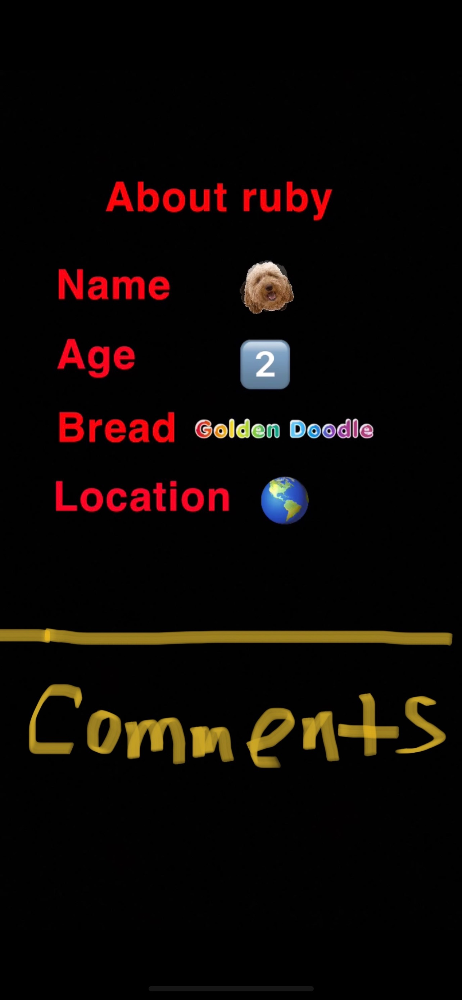

# Pet Tinder - Find Your Perfect Match
What is Pet Tinder 
An app that allows the user to swipe left, right, or superlike various pets that are up for adoption.
You can add pets to your favorites.

## The pets are adoptable and can be found on this API:  https://www.petfinder.com/developers/

## Models
This is the part I'm the most confused about.
I was thinking:
Model 1- users
Model 2- pets
Model 3- actions columns -> like, dislike, superlike

## Layout 
Route 1-
Create account or login
Don’t want to make an account? Use this login info …

Route 2- login takes you to main page
Swipe page 
Can swipe right, left, or hit a super like button 

Route 3- Favorites Page
You can see your collection 

Route 4- After clicking on a pet from your favorites, you can view their information 

## User Stories 
- As a user I want to access a site that shows me adoptable pets one image at a time 
- As a user I want to be able to like, dislike, and super-like different pets
- As a user I want to be able to leave comments on the pet profiles 
- As a user I want to see the pets that I liked or super-liked

## MVP GOALS
- Four routes
- Swipe ability 
- Superlike button
- Favorites
- Pet info from the API

## STRETCH GOALS
- Navbar
- Very CSSified 

## RESTful Routing 

## Wireframes 

